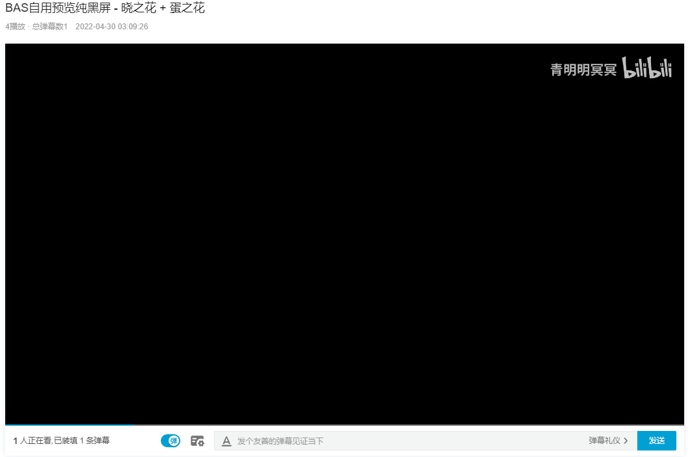

# genBasFromGIF

## Intro
Pure python based
基于Python > 3.7搭建的工作流程.\
用于通过GIF动画文件生成对应的BAS(Bilibili Animation Script)文件.\
目标是直接复制粘贴bas_out中的client.bas到bilibili视频中去，实现如下特殊弹幕效果：\
[BAS自用预览纯黑屏 - 晓之花 + 蛋之花](https://www.bilibili.com/video/BV1eS4y1a7g8)

## Installation
1. Ensure Python3.7+ Install Done
2. > pip install -r requirements.txt

## Instructions
1. 更替assets下client.gif为你自己的设定GIF文件，名字保持client.gif不变.
2. 直接执行genBasFromGIF.py
3. 将会在以下目录中得到所涉及到的所有中间产物以及输出文件.
├─ascii_txt => 用于存放每一帧的字符画\
├─assets => 输入文件，即GIF\
├─**bas_out => 用于存放BAS文件**\
├─gif_preframe => 用于存放GIF每一帧图片，以为PNG格式保存\
└─src => 代码本体

## Acknowledgment
谢谢坦克爹提供的晓之花GIF文件捏 -> [亲爹的B站](https://space.bilibili.com/134980)\
关注[红晓音Akane](https://space.bilibili.com/899804)喵，关注红晓音Akane谢谢喵，[直播间](https://live.bilibili.com/411318)移步B站.\

## Extra
每日必须：遛一下[冬之花](https://www.bilibili.com/video/BV1bY411G7hR)（1/1）\

